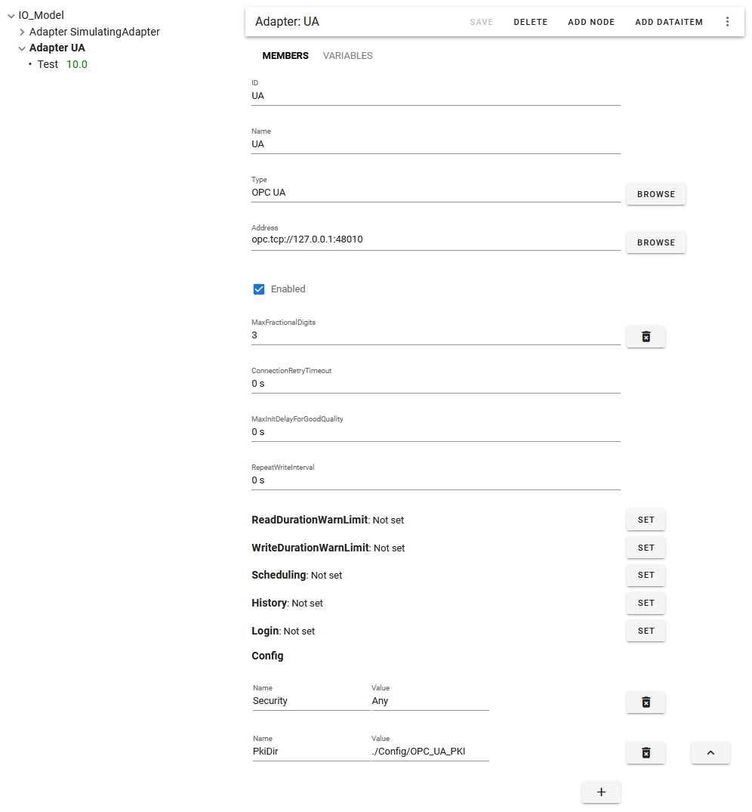
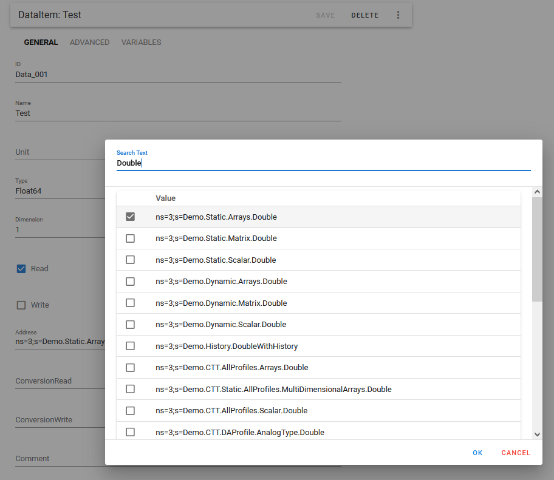

# OPC UA adapter

## Configuration settings for OPC UA adapter:

* **Type**: OPC UA
* **Address**: opc.tcp://hostname:port/

  If the OPC UA server is located on the same machine as the ifakFAST installation then hostname can simply be "localhost" or "127.0.0.1". The port number is typically 4840, 48010 or 49380.

* If the OPC UA server requires **authentication using username and password**, you need to provide this information in the **Login** section
* If the OPC UA server requires **authentication using a X509 certificate**, you need to add the ifakFAST "Mediator.IO.OPC_UA" certificate to the list of trusted certificates on the OPC UA server side. How this is done exactly, depends on the particular OPC UA server implementation. To make the "Mediator.IO.OPC_UA" certificate available on the OPC UA server side, you need to first try to connect to the OPC UA server. During this initial connection, the "Mediator.IO.OPC_UA" certificate is transmitted to the OPC UA server and stored in the untrusted list of certificates.
* Optional: **Security** - defaults to "None" (no encryption). You can enforce a specific security policy for communication by using the Config setting "Security" with any value from the following list:
  - Any
  - None
  - Basic128Rsa15
  - Basic256
  - Https
  - Basic256Sha256
  - Aes128_Sha256_RsaOaep
  - Aes256_Sha256_RsaPss

  If you use the value "Any", then the most secure communication policy supported by the OPC UA server will be used automatically.
* Optional: **PkiDir** - You can specify a specific folder for storing the ifakFAST Mediator certificate, e.g. "./Config/OPC_UA_PKI". Otherwise, C:\\Users\\{UserName\}\\AppData\\Local\\ifakFAST.IO.OPC_UA will be used on Windows.
* Optional: **LogLevel** - If you have trouble connecting, you may want to set the LogLevel to "Debug" or even "Trace". You can find the logged information in folder "Data\Logfile.log".
* Optional: **Timeout** - defaults to 15 seconds. You may want to increase this value, if the downstream communication of the OPC UA server is very slow.
* Optional: **MaxAge** - defaults to 0 seconds which means that on every read request from the OPC UA client to the OPC UA server, the server will try to get a new value from the downstream device or data source. If the value is larger than 0 seconds then a cached value may be returned if it is not older than MaxAge.
* Optional: **ExcludeUnderscoreNodes** - defaults to true which means that tags that have a name starting with an underscore character, will be excluded when browsing for tags.

## Configuring DataItems

When adding DataItems to the OPC UA adapter, you can use the **Browse** button next to the **Address** property to view all tags provided by the OPC UA server. When the address space of the OPC UA server is very large, it may take several minutes on first opening the Browse dialog. 
In the root folder of the ifakFAST installation, a file called "Browse_OPC_UA.txt" is stored containing all browsed tag addresses.

